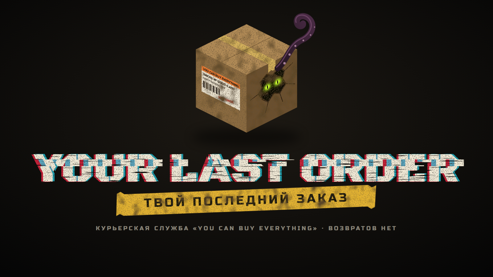
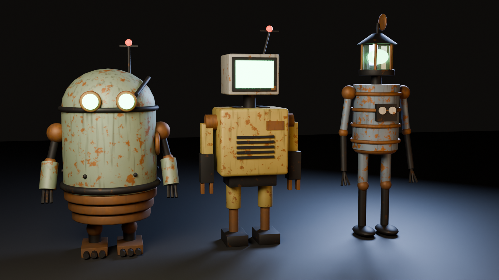

# Your Last Order — Твой Последний Заказ

Кооперативный хоррор на Unity 6 для 1–4 игроков. Роботы-курьеры компании «You Can Buy Everything»
развозят посылки по уровням в стиле Backrooms. Полный дизайн игры — в [docs/GDD.md](docs/GDD.md),
игра с друзьями через Steam — в [docs/STEAM.md](docs/STEAM.md).



## Скачать и играть
Готовая сборка для Windows: **[Releases → YourLastOrder-Windows.zip](https://github.com/german122lol44466-max/YourFinalOrder/releases/latest)**.
Распакуйте архив, запустите Steam, затем `YourLastOrder.exe`. Unity для этого не нужен.
Сборки создаются автоматически (см. [docs/BUILD.md](docs/BUILD.md)).

## Что уже есть
- **Главное меню** (UI Toolkit). На фоне — грязный шаттл курьерской службы летит сквозь космос от третьего лица:
  пламя реактора, звёзды на варп-скорости, туманности. Каждые ~16 с шаттл «прыгает» в другую
  реальность со вспышкой и искажениями, и цвета мира меняются.
- **Игра с друзьями через Steam**: лобби, приглашения через оверлей Steam, вход по коду лобби,
  P2P-соединение через релеи Valve (порты открывать не нужно). Запасной вариант — игра по IP.
- **Настройки**: разрешение с соотношением сторон (16:9, 16:10, 21:9, 32:9), режим окна, V-Sync,
  лимит FPS, пресет качества, масштаб рендера; чувствительность мыши, инверсия, FOV; громкость и
  микрофон; вид прицела с превью; модель робота.
- **Старт смены**: хост нажимает «Начать смену», все переносятся в грузовой отсек шаттла
  и появляются там роботами от первого лица. Есть фонарик, выносливость, пауза и выход в меню.
- **Три робота на выбор** («Консерва», «Тостер», «Фонарь»): выбираются в настройках карточками,
  модель видят все игроки. Руки качаются при ходьбе, голова поворачивается за взглядом,
  светящееся «лицо» барахлит (сильнее рядом с монстром), а антенна крутится, пока игрок говорит (V).
- **Модели из Blender**: шаттл (`Tools/Blender/build_shuttle.py`) и роботы (`Tools/Blender/build_robots.py`)
  строятся скриптами с запечёнными грязными текстурами.
- **Логотип и аватарка**: `Branding/` (исходники — `Tools/Branding/build_logo.mjs`).



## Первый запуск
1. Установите **Unity 6000.0 LTS** (Unity 6) и **Git** (нужен, чтобы Unity скачал пакет Steamworks.NET).
2. Откройте папку репозитория в Unity Hub (Add → выбрать папку). Первый импорт займёт несколько минут.
3. В верхнем меню Unity: **Your Last Order → Собрать проект**. Скрипт настроит URP, создаст материалы,
   префабы, сцены `Menu` и `Game` и добавит их в Build Settings.
4. Откройте `Assets/_Project/Scenes/Menu.unity` и нажмите **Play**.

Сцену `Game` можно запускать и напрямую: тогда она сама поднимет локальный хост для тестов.

## Управление
| Клавиша | Действие |
|---|---|
| W A S D | движение |
| Shift | бег (тратит выносливость) |
| Ctrl / C | присесть |
| Пробел | прыжок |
| E | взаимодействие |
| F | фонарик |
| Esc | пауза / меню |

## Структура
```
Assets/_Project/
  Art/            модели (Shuttle.fbx), шрифты (OFL)
  Editor/         ProjectBuilder — сборка сцен и префабов; копирование steam_appid.txt в билд
  Scripts/
    Core/         сессия (хост/клиент/лобби), настройки, спавн игроков, прицелы
    Steam/        Steamworks: инициализация, лобби и приглашения, сетевой транспорт Steam
    Menu/         главное меню: UI, шаттл, реактор, космос, прыжки между реальностями
    Player/       управление, фонарик, HUD, шаги, эффекты страха
    AI/ Game/     прототип монстра и игрового цикла (для будущих уровней)
    World/        окружение (мерцающие лампы)
    Audio/        процедурные звуки-заглушки
  UI/             разметка и стили меню (UXML/USS)
Tools/Blender/    Python-скрипты для Blender, генерирующие модели
docs/             дизайн-документ, инструкция по Steam, рендеры
steam_appid.txt   480 — тестовый App ID Steam (Spacewar), пока нет своего
```

## Blender и графика
Модели пересобираются командами (Blender 4.x/5.x):
```
blender --background --python Tools/Blender/build_shuttle.py -- --preview
blender --background --python Tools/Blender/build_robots.py -- --preview
```
Логотип и аватарка (нужны Node.js и Playwright):
```
node Tools/Branding/build_logo.mjs
```
| Файл | Для чего |
|---|---|
| `Branding/logo.png` | логотип на прозрачном фоне |
| `Branding/logo_dark.png` | логотип на тёмном фоне (для постов) |
| `Branding/avatar.png`, `avatar_184.png` | аватарка / иконка (184×184 — для Steam-группы) |
